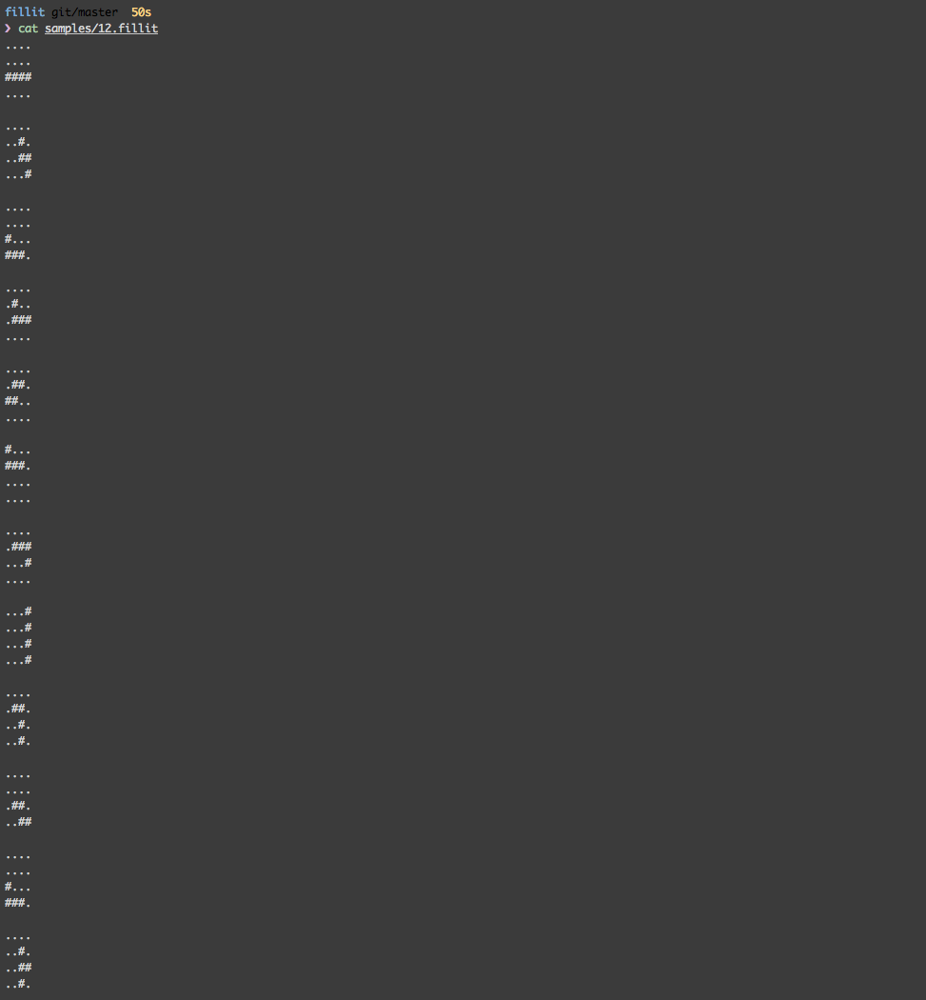
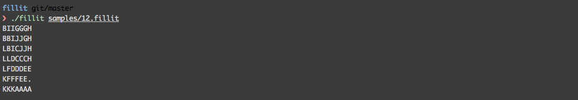

# Fillit

Ce projet vous permet de decouvrir une problematique récurrente en programmation : la recherche d’une solution optimale parmi un très grand nombre de possibilités, dans un délai raisonable.

Il s'agit d'agencer des Tetriminos (figure géométrique formée de 4 blocs venant du jeu Tetris) entre eux et de déterminer le plus petit carré possible pouvant les acueillir.

Le programme prend en paramètre un fichier décrivant la liste des Tetriminos à agencer :



##compiler le programme
dans le dossier du projet :
```
make
```

##executer le programme
```
./fillit samples/12.fillit
```


